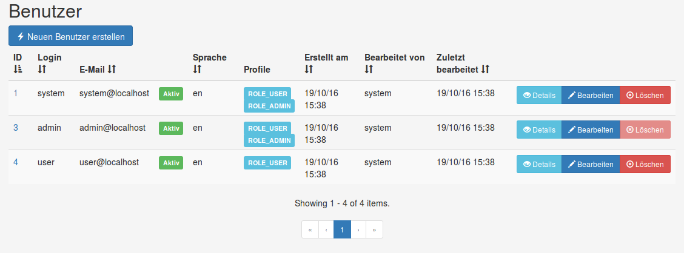

# JHipster
## Wie eine Lowlevel-Entwicklerin die Web-Welt entdeckt

Disclaimer:

Die letzten zwei Jahre habe ich mich hauptsächlich mit dem Linux Kernel und wie
Android auf Betriebssystemebene funktioniert beschäftigt.
Entwickelt habe ich zum Großteil mit C und einer Prise Python als Skriptsprache.
Daher ist meine Sicht auf jHipster vermutlich eine andere, als die einer Java Expertin.

### Was ist jHipster überhaupt?
[JHipster](https://jhipster.github.io/) ist ein
[Yeoman Generator](http://yeoman.io/), der eine Basis-Web-App mit
[Bootstrap](http://getbootstrap.com/) und [AngularJS](https://angularjs.org/)
als Frontend und [Spring Boot](https://projects.spring.io/spring-boot/) als
Backend generiert.

Alles klar, oder?

Hier eine kleine Erklärung der Bestandteile:

* Yeoman ist ein Tool um Applikationen oder Teile davon zu generieren, was
dann konkret generiert wird, hängt vom tatsächlichen Generator ab, in unserem Fall
(jHipster) eine Web-App mit Angular und Spring Boot
* Bootstrap ist ein HTML/CSS/JavaScript Framework und bietet zum Beispiel
Templates für hübsche HTML Seiten
* AngularJS ist ein JavaScript Framework für den Frontend-Teil von Web-Apps
* Spring Boot ist eine vorkonfigurierte Spring Applikation die auch schon
einen Web-Server integriert hat

### Was brauche ich alles für jHipster?
Als erstes brauche ich natürlich `Java8` und `git`, soweit so gut, die kennt ja
wahrscheinlich jede, die bis hierher gelesen hat.

Dazu benötige ich allerdings noch einiges andere:

* [`npm`](https://www.npmjs.com/) einen Package-Manager für JavaScript, über dem man jede Menge Module
installieren kann
* [`bower`](https://bower.io/), ein weiterer JavaScript Package-Manager (`bower` kann bereits mit
`npm` installiert werden: `npm install -g bower`)
* [`gulp`](http://gulpjs.com/) ein Buildtool, ich nenne es jetzt mal `make` für JavaScript
(`npm install -g gulp-cli`)
* Yeoman der über das Kommando `yo` aufgerufen wird (`npm install -g yo`)
* JHipster selbst natürlich (`npm install -g generator-jhipster`)

JHipster bietet auf seiner Seite auch eine ausführliche
[Anleitung](https://jhipster.github.io/installation/ "Installationsanleitung")
die beschreibt wie man alles installieren muss.

### Wie generiere ich eine Web-App?
Erstmal eine **wichtige** Sache vorab: jHipster generiert die Web-App in dem
Verzeichnis in dem man steht. Also erst einen **Ordner für die App anlegen**
und sich da hinein begeben, bevor man die App generiert.

Befindet man sich in dem Ordner, hat alles installiert und ist bereit ein paar
Fragen zu beantworten, kann man auch schon mit dem Generieren beginnen. Mit dem
Befehl `yo jhipster` startet man das Ganze, was dann so oder so ähnlich
aussieht:


Ich habe eine Beispiel-App gebaut, die ich *Boardgame Heaven* genannt habe.
Bei der Konfiguration habe ich mich meistens für die Default-Option entschieden.

Nachdem man alle Fragen beantwortet hat, laden `npm` und `bower` die nötigen
Pakete aus dem Internet und etwa 3 Minuten später hat man eine fertige
Applikation.

Ein Vorteil von Spring Boot ist, dass man gleich einen eingebetteten Webserver
dabei hat, der gestartet wird, wenn man die App startet. Wenn man dann also
folgendes auf der Kommandozeile sieht, kann man sich die App schon im Browser
ankucken:

```
----------------------------------------------------------
        Application 'boardgameHeaven' is running! Access URLs:
        Local:          http://127.0.0.1:8080
        External:       http://127.0.1.1:8080
----------------------------------------------------------
```

*Du erklärst so toll Gulp, Bower und Yeoman. Gradle fehlt aber :) Ist vielleicht erwähnenswert, weil es all die Arbeit in der Java Welt macht und sich auch noch slebst herunterlädt ;)*

Man hat auch die Möglichkeit in einem zweiten Terminal Fenster `gulp` zu
starten. `gulp` verwendet [*Browser-Sync*](https://www.browsersync.io/),
ein Tool, das den Browser automatisch refreshed wenn man etwas an der
App geändert hat. Startet man nun `gulp` öffnet sich automatisch ein Tab
im Browser und zeigt die generierte App an.


Wenn das alles funktioniert hat, bietet es sich an diesen Stand als initialen
Commit ins `git` zu packen, damit man im Zweifelsfall wieder zurück kann.

###Was kann die App jetzt alles?
In der Web-App gibt es jetzt bereits "Sign in/ Register". Einloggen kann man
sich in der Default-Konfiguration mit dem Klassiker (admin: admin, user: user).


Hat man beim Generieren Internationalisierung ausgewählt, kann man auch die
Sprache verstellen.


Hat man sich als *user* eingeloggt kann man sein Profil anpassen, sein Passwort
ändern und seine Sessions einsehen. Es gibt auch einen zusätzlichen Reiter
*Entitäten*, mehr zu diesen gleich.

Wenn man sich allerdings als Admin einloggt, kann man schon ein bisschen
mehr tun. Unter dem Reiter *Administration* findet sich:

1. User Verwaltung

   
2. Status der Applikation
   
   
3. Konfiguration der Applikation

   
4. Metriken zur Applikation

   
5. Übersicht über die Login-Versuche (erfolgreich/nicht erfolgreich)

   
6. Übersicht über die Logger mit Konfiguration der Log-Level

   
7. Übersicht über die REST-API der App (bereitgestellt von [swagger](http://swagger.io/))
   
   
8. Interface zur Datenbank

Das ist jetzt zwar schon ganz schön viel, aber so richtig was damit machen
kann man noch nicht.

###Wie bekomme ich da meine Entitäten rein?
Meistens will man ja mit seiner Web-App Daten anzeigen, eingeben und/oder
bearbeiten (klassische CRUD-Anwednung). JHipster kann hier schon einiges
generieren und es gibt dafür nicht nur eine Möglichkeit, sondern gleich mehrere.

####Entitäten-Generator
Die einfachste ist der Entitäten-Generator, der mit
`yo jhipster:entity irgendein_name` aufgerufen wird. Dieser erzeugt eine
Entität mit dem gewählten Namen und läßt einen Felder und, bei SQL-Datenbanken,
auch Beziehungen hinzufügen. Wie bei den anderen Möglichkeiten auch, kann
man beim Generieren bereits Constraints angeben (ob das Feld gesetzt sein
muss, minimale/maximale Länge bei Strings oder min/max Werte für Integer).

Beim Erzeugen von Beziehungen muss man beachten, dass zuerst die Entität
generiert werden muss, der die Beziehung "gehört". Was vielleicht auch
überrascht: wählt man beim Erzeugen der App eine NoSQL Datenbank (unterstützt
werden MongoDB und Cassandra) kann
[jHipster derzeit keine Beziehungen generieren](https://github.com/jhipster/generator-jhipster/issues/901).

####[`jdl`](https://jhipster.github.io/jdl/)
Eine weitere Möglichkeit Entitäten zu erzeugen ist `jdl`, der
[*jHipster Domain Language*](https://jhipster.github.io/jdl/).
Hier erstellt man eine `.jh` Datei und trägt dort die Entitäten ein.
JHipster bietet auch einen
[`jdl` Editor](https://jhipster.github.io/jdl-studio/) an, der einem gleich
ein Entity-Relationship-Diagramm aus dem `jdl` erstellt.
Die `jdl` Datei für meine Beispiel-Applikation sieht so aus:


In meinem Beispiel gibt es eine Beziehung von `boardgame` auf `user`, obwohl
ich `user` nicht als Entität definiert habe. Das liegt daran, dass die `user`
Entität bereits beim Anlegen der Applikation erzeugt wird. Sie wird für das
User-Management benötigt. Beziehungen auf diese spezielle Entität sind nur
möglich, wenn die andere Entität der "Besitzer" der Beziehung ist. Hier kann
es auch passieren, dass der Code, der in `user` generiert werden müsste, nicht
erstellt wird und von Hand geschrieben werden muss. Bei einer `many-to-many`
Beziehung, wie ich sie definiert habe, muss in `user` Code eingefügt werden,
damit die App korrekt funktioniert.

####[JHipster-UML](https://jhipster.github.io/jhipster-uml/)
Als weitere Möglichkeit steht auch noch ein
[Tool](https://jhipster.github.io/jhipster-uml/) zur Verfügung, das aus
UML-Diagrammen Entitäten generiert. Das habe ich allerdings nicht ausprobiert.

####Was wird zu den Entitäten generiert?
Zu jeder Entität generiert jHipster:

* Einen List-View mit einer Liste der bisher gespeicherten Instanzen (Pagination
ist konfigurierbar), wobei jeder Eintrag drei Buttons hat, "Details", "Bearbeiten"
und "Löschen"

   

* Einen Detail-View zur Ansicht einer Instanz

   

###Wie zeige ich meine App der Welt?

*Kubernetes und Cloud Foundry sind streng genommen keine Cloud-Anbieter, sondern eher Platformen, die man sich wo installiert, zum Beispiel bei einem Cloud-Anbieter. Hier vielleicht einfach generell Plattform schreiben.*

Mit ein paar einfachen Befehlen kann man die Applikation für Produktion bauen
und bei einem Cloud-Anbieter seiner Wahl ([Heroku](https://www.heroku.com/),
[Cloud Foundry](https://www.cloudfoundry.org/),
[Kubernetes](http://kubernetes.io/), [AWS](https://aws.amazon.com/)) deployen.
Ich hab das einmal bei [Heroku](https://jhipster.github.io/heroku/) ausprobiert:

1. Eine Account anlegen und den
[Heroku Toolbelt](https://devcenter.heroku.com/articles/heroku-command-line)
installieren
2. `heroku login`
3. `yo jhipster:heroku`

Das war's schon. Mit `heroku logs --tail` kann man sich das Log anschauen. Es
kann sein, dass die Applikation
[nicht korrekt startet](https://github.com/jhipster/generator-jhipster/issues/1763),
weil sie zu lange braucht und der Timeout bei Heroku ziemlich klein ist
([60 Sekunden](https://devcenter.heroku.com/articles/limits#boot-timeout)). Dann einfach noch
mal starten, bei mir war sie beim zweiten Mal schneller und hat korrekt
gebootet. Man kann auch ein Ticket bei Heroku aufmachen und sie bitten den
Timeout zu vergrößern.

###Fazit
Mit jHipster hat man ziemlich schnell eine ziemlich ansehnliche CRUD App,
die auch noch einiges an Features hat, wie zum Beispiel User-Management
und Internationalisierung. Wenn man eine AngularJS und Spring Boot Applikation
haben will, lohnt es sich jHipster zu benutzen um den initialen Anfangsaufwand
zu minimieren. Nach dem Erzeugen macht es aber Sinn die App dann von Hand weiter
zu entwickeln. Auch wenn man beispielsweise nachträglich weitere Entitäten generieren
kann, muss man doch einiges von Hand anpassen, damit wieder alles zusammen passt.

*Ein Punkt wäre noch interessant aus meiner Sicht: Ist jHipster ein guter Einstieg in die Java/Web Welt oder ist es zuviel auf einmal aus deiner Sicht? Was ist dein Tipp für Leute, die deinen Artikel lesen und jetzt loslegen wollen?*

###Quellen

* [JHipster Seite](https://jhipster.github.io/)
* [JDL Studio](https://jhipster.github.io/jdl-studio/)
* [JHipster Minibook bei InfoQ](https://www.infoq.com/minibooks/jhipster-mini-book)
* [BoardgameHeaven bei GitHub](https://github.com/constanze-hausner/boardgame-heaven)
